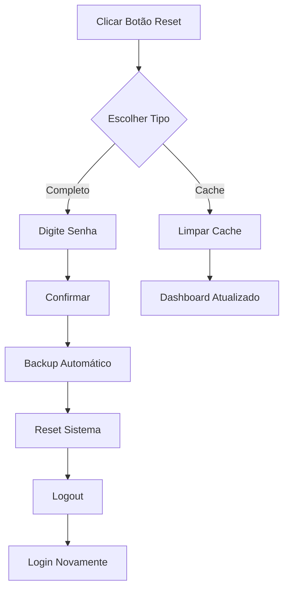

# 🎯 RESET COMPLETO VIA DASHBOARD - LUCRATIVABET

## ✅ FUNCIONALIDADE IMPLEMENTADA NO PAINEL

### 📍 LOCALIZAÇÃO DO BOTÃO
**Dashboard Admin → Botão "Limpar Cache/Reset" (vermelho com ícone de lixeira)**


## 🚀 COMO USAR

### 1️⃣ ACESSE O DASHBOARD
```
http://localhost:8000/admin
Login: admin@admin.com
```

### 2️⃣ CLIQUE NO BOTÃO "LIMPAR CACHE/RESET"
Localizado no canto superior direito, ao lado de "Gerar Dados de Teste"

### 3️⃣ ESCOLHA O TIPO DE RESET

#### OPÇÃO 1: 🧹 LIMPAR CACHE
- Remove apenas cache temporário
- Mantém todos os dados
- Não precisa de senha
- Uso rápido e seguro

#### OPÇÃO 2: ⚠️ RESET COMPLETO
- Remove TODOS os dados de teste
- Mantém apenas usuários admin
- **REQUER SENHA DE CONFIRMAÇÃO**
- Cria backup automático antes

### 4️⃣ CONFIRME A OPERAÇÃO

Para **Reset Completo**:
1. Selecione "Reset Completo"
2. Digite sua senha de admin
3. Clique em "Executar"
4. Sistema fará backup automático
5. Você será deslogado
6. Faça login novamente

## 🔒 SEGURANÇA IMPLEMENTADA

### ✅ Proteções Ativas:
1. **Modal de Confirmação** - Evita cliques acidentais
2. **Opções Claras** - Escolha entre cache ou reset completo
3. **Senha Obrigatória** - Para reset completo
4. **Backup Automático** - Antes de qualquer reset
5. **Verificação de Admin** - Apenas admins podem executar

## 📊 O QUE ACONTECE NO RESET COMPLETO

### REMOVIDO ❌
- Todos os depósitos de teste
- Todas as apostas de teste
- Todos os saques de teste
- Todos os usuários de teste
- Todas as transações
- Todo histórico de afiliados

### MANTIDO ✅
- Usuários administrativos:
  - admin@admin.com
  - admin@lucrativabet.com
  - dev@lucrativabet.com
- Estrutura do banco de dados
- Configurações do sistema
- Arquivos e código

### ZERADO 🔄
- Carteiras dos admins (saldo = 0)
- Cache completo
- Métricas do dashboard

## 🎯 FLUXO VISUAL



## 💾 BACKUPS AUTOMÁTICOS

### Localização:
```
storage/backups/reset_YYYY-MM-DD_HH-mm-ss/
├── users.json
├── deposits.json
├── orders.json
├── withdrawals.json
├── wallets.json
└── transactions.json
```

### Como Restaurar:
Use o script `restore-backup.sh` criado anteriormente se necessário

## 🔍 VERIFICAÇÃO PÓS-RESET

Após o reset completo, o dashboard mostrará:
- ✅ Depósitos: R$ 0,00
- ✅ Saques: R$ 0,00
- ✅ Usuários: 1-3 (apenas admins)
- ✅ Apostas: 0
- ✅ Gráficos: Todos zerados

## ⚡ INÍCIO DA OPERAÇÃO REAL

Após o reset:
1. Sistema está 100% limpo
2. Pronto para receber usuários reais
3. Depósitos reais serão registrados
4. Dashboard mostrará dados 100% reais

## 🆘 TROUBLESHOOTING

### Problema: "Senha incorreta"
**Solução**: Use a senha do usuário admin@admin.com

### Problema: "Não autorizado"
**Solução**: Certifique-se de estar logado como admin

### Problema: Página não atualiza após reset
**Solução**: Faça logout e login novamente

## ✅ VANTAGENS DO RESET VIA DASHBOARD

1. **Interface Visual** - Não precisa de terminal
2. **Confirmação Dupla** - Evita erros
3. **Backup Automático** - Sempre seguro
4. **Feedback Visual** - Notificações claras
5. **Processo Guiado** - Passo a passo intuitivo

## 📝 RESUMO

**O sistema de reset agora está 100% integrado ao dashboard!**

- Clique no botão "Limpar Cache/Reset"
- Escolha o tipo de reset
- Digite senha se for reset completo
- Sistema faz tudo automaticamente
- Pronto para operação real!

---

## 🎉 IMPLEMENTAÇÃO COMPLETA!

**Tudo gerenciado pelo dashboard como solicitado.**
**Nenhuma linha de comando necessária.**
**Sistema 100% visual e intuitivo.**